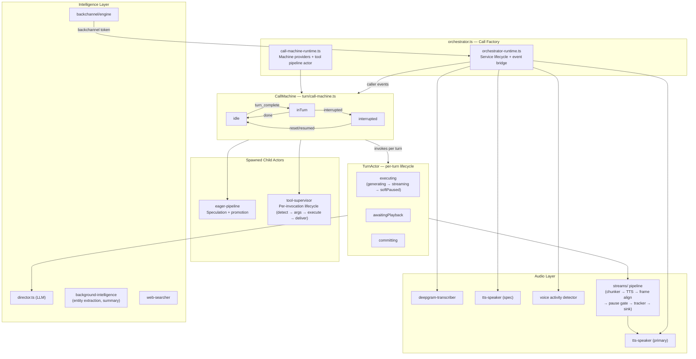
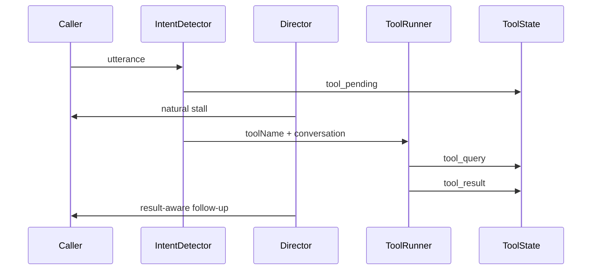
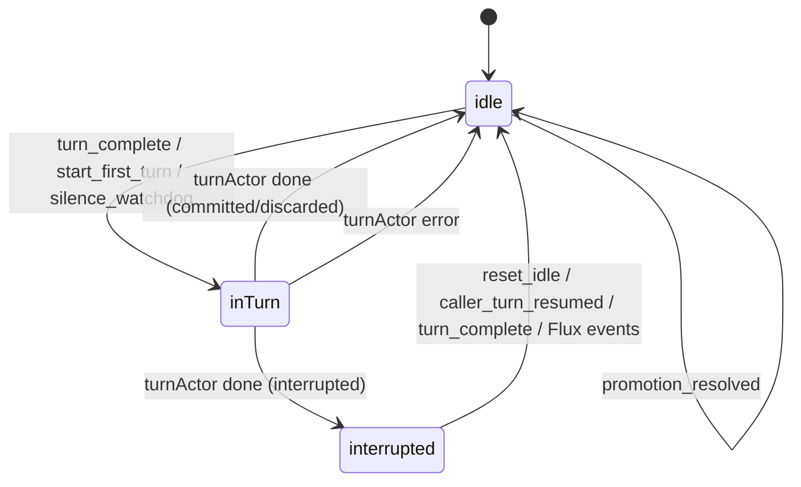
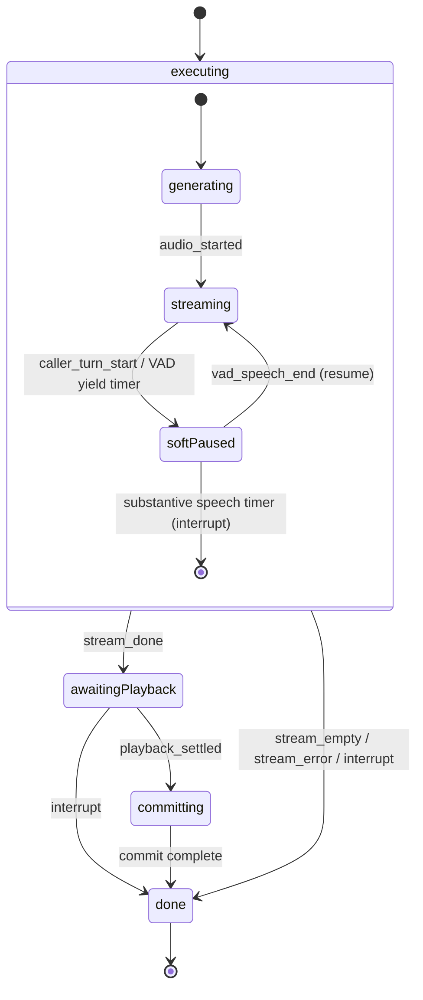
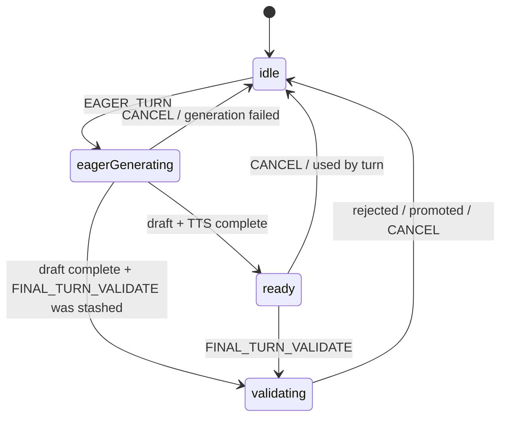
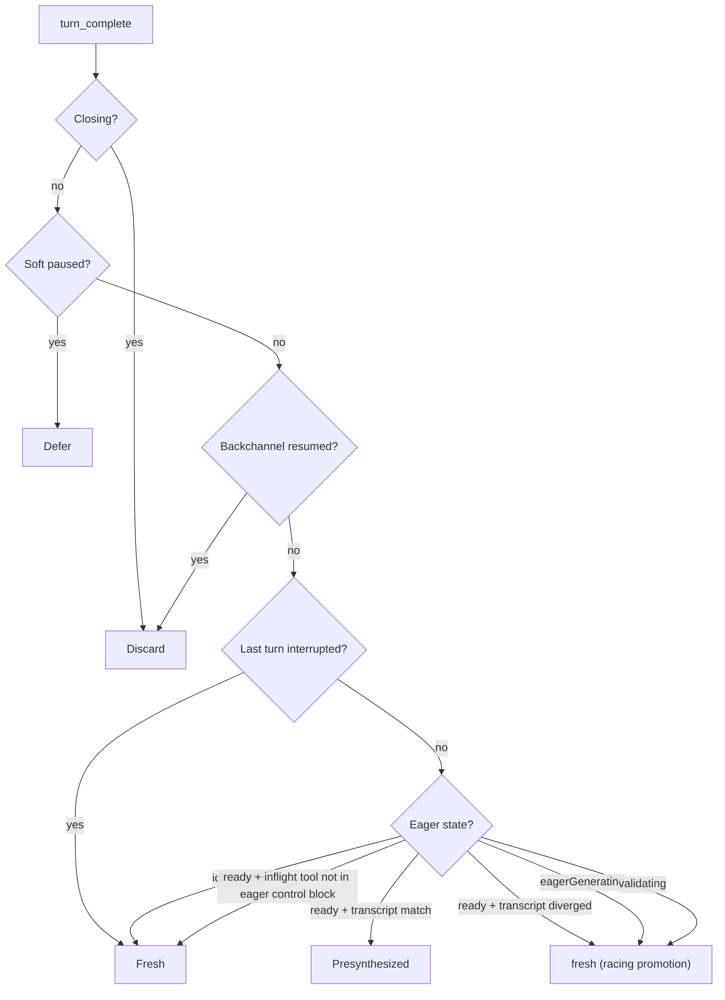

# Mimic — Realtime Voice Engine

Mimic powers voice calls. When a caller speaks, Mimic transcribes their speech in real time, generates an intelligent response, converts it to audio, and streams it back — all while managing interruptions, backchannels, tool execution, and eager pre-generation to minimize latency.

## How a Call Works

1. **Caller speaks** — audio flows into Deepgram Flux, which emits partial transcripts in real time.
2. **Eager EOT** — when Flux signals an early end-of-turn (`EagerEndOfTurn`), Mimic starts generating a response and pre-synthesizing audio via a dedicated spec TTS session before the caller has fully finished. It may also fire backchannel tokens ("mm-hmm", "right") so the caller feels heard.
3. **Caller finishes** — Flux emits the final `EndOfTurn`. If the eager draft is ready and the transcript hasn't diverged, pre-generated audio flushes immediately. If the transcript changed, a promotion classifier (Groq 70B) races against fresh generation to decide whether the eager draft is still usable.
4. **Agent responds** — the LLM response streams token-by-token into TTS (Inworld), which streams audio chunks back to the caller.
5. **If the caller interrupts**, Mimic stops speaking, estimates what they heard via `estimateHeardPortion`, and prepares the next response with that context (partial transcript committed with an em-dash).
6. **Tools** — when the caller triggers a tool (booking, search, etc.), a fast intent detector starts a stall while a schema-aware tool runner extracts exact arguments, executes, and appends the query/result to persistent call state.

## System Architecture



## Tool Lifecycle

Tools run through the **tool supervisor** (`supervisor-machine.ts`), which spawns a child **invocation actor** per detected tool intent. Each invocation owns its lifecycle (`detecting → awaiting_args → executing → ready`). A background classifier (`watcher.ts`) decides `execute / not_ready / none` per utterance. The director does NOT call tools natively — it speaks stall/filler via control-block guidance while tools run in the background. Results are committed to director history and injected into the `<tool_results>` section of subsequent control blocks. The agent naturally incorporates results on the next caller-triggered or silence-watchdog turn — no proactive follow-up turn is fired.



**Control block signals** — the strategy receives an accumulating `<context>` block:

```text
tool_queries:
  checkCalendar({"date":"Thursday"}) -> completed
  bookMeeting({"startTime":"...","email":"john@gmail.com"}) -> executing

tool_results:
  checkCalendar: {"date":"2026-05-08","slots":[...]}

tool_pending: bookMeeting
```

When a tool is pending, the Director stalls naturally. When a result or tool error arrives, it is appended to `tool_results`; the Director uses conversation history to avoid repeating already-spoken facts.

**Transport:** Built-in `web_search` routes through `WebSearcher` (OpenAI Responses API). Custom tools route through a Redis pub/sub socket (`tool-transport.ts` → `requestToolExecutionOverSocket`) so SDK clients can execute tools locally without exposing secrets to the server.

## CallMachine States



**idle** — waiting for the caller to finish speaking. Manages eager speculation and tool intent detection. Runs a silence watchdog (6s idle delay) that escalates through up to 3 follow-up prompts, then a closing turn, then hangup. Reenter on `caller_turn_start`, `caller_update`, `caller_eager_turn` to rearm the watchdog. Empty/whitespace-only updates are filtered by `isMeaningfulCallerUpdate`.

**inTurn** — a TurnActor is active. Forwards interrupt/playback/VAD events. On completion, emits `turn_outcome` and optionally delivers tool follow-ups from persistent tool state. Handles `promotion_resolved` for mid-turn eager swap — if fresh generation hasn't sent audio yet and no tools are inflight, the turn actor restarts with presynthesized audio.

**interrupted** — transient state after an interrupted turn. Mirrors idle-state Flux handlers (`caller_turn_start`, `caller_update`, `caller_eager_turn`, `caller_turn_complete`) so end-of-turn signals aren't dropped after a substantive-speech interrupt.

## TurnActor Lifecycle



## Interrupt Model

Interrupts stop the agent mid-speech when the caller starts talking, the call ends, or the caller speaks substantially during a soft-pause. The system is layered: CallMachine decides *when* to interrupt, TurnActor decides *how* to clean up, and the outcome feeds back into the next turn.

### Interrupt sources

| Source | InterruptReason | Trigger |
| --- | --- | --- |
| New caller turn arrives while agent is speaking | `new_turn_started` | `caller_turn_complete` during `inTurn` |
| Call disconnects | `call_ended` | Shutdown coordinator |
| Caller speaks for longer than substantiveSpeechMs during soft-pause | `caller_substantive_speech` | Timer in TurnActor `softPaused` |
| VAD yield timer fires during awaitingPlayback | `caller_started_speaking` | Timer in TurnActor `awaitingPlayback.vadActive` |

### Flow

```text
CallMachine (inTurn)
  │
  │── receives caller_turn_complete or close ──►  sends { interrupt, reason } to TurnActor
  │                                                │
TurnActor                                          │
  │◄──────────────────────────────────────────────-─┘
  │
  │── buildInterruptPlan(currentState, trigger) → InterruptConfig
  │     ├── resources: which subsystems to tear down (abort, audio, tts, barge, softPause)
  │     ├── reason: why (derived from event or overridden by trigger)
  │     └── flags: fade, commit strategy, metrics
  │
  │── execute cleanup ─────────────────────────────────────────────────
  │     1. Abort LLM generation (AbortController.abort)
  │     2. Clear audio buffer + optional fade tail
  │     3. Interrupt TTS session (WebSocket cancel message)
  │     4. Compute heardPortion via estimateHeardPortion (barge)
  │     5. Commit partial transcript to director history
  │     6. Cancel eager pipeline (sendParent → cancel_eager_from_turn)
  │     7. Assign interruptReason + clear stale state
  │
  │── enters done state ──► output: TurnOutcome { kind: 'interrupted', reason, interruptContext }
  │
CallMachine
  │── receives turnActor.onDone with interrupted outcome
  │── transitions to `interrupted` state
  │── emits turn_outcome event
  │
  │── interrupted state handles incoming Flux events (caller_turn_start,
  │   caller_update, caller_eager_turn, caller_turn_complete) identically
  │   to idle, preventing the agent from going dead
  │
  │── transitions back to idle on next caller event
```

### InterruptConfig derivation

The `buildInterruptPlan(state, trigger)` function in `turn-actor.ts` maps the TurnActor's current state to the correct cleanup resources:

| TurnActor state | abort | audio+tts | barge | softPause | Notes |
| --- | --- | --- | --- | --- | --- |
| generating | yes | yes | no | no | No audio sent yet; clears draft, commits user transcript |
| streaming | yes | yes | yes | no | Audio in flight; estimates heard portion |
| softPaused | yes | yes | yes | yes | Audio paused; skips fade, records soft-pause metrics |
| awaiting | no | yes | yes | no | Abort already nulled; audio/TTS may have residual |
| awaiting (call_ended) | no | no | no | no | Just commits the draft |

### Eager cancellation

The eager pipeline is cancelled in the following situations:

- **`promotion_resolved`** (parent-level default) — any failed or unused promotion cancels eager
- **`caller_turn_start`** — new utterance boundary invalidates speculation
- **Turn start with non-eager strategy** — `applyStartDispatch` cancels when strategy is fresh (non-racing)
- **TurnActor interrupt** — every interrupt cleanup calls `cancelEager` via `cancel_eager_from_turn`
- **`inTurn` promotion_resolved** — the complex racing-promotion handler cancels on failure/conflict

### caller_turn_resumed (Flux TurnResumed)

`TurnResumed` signals that the caller is still mid-utterance after an earlier `EagerEndOfTurn` was retracted. Its handling varies by state:

- **idle** — reenter to rearm the silence watchdog, mark caller active, reset silence count
- **inTurn** — mark eager as resumed (`MARK_TURN_RESUMED`), mark caller active, and forward to turnActor (which rearms the substantive-speech timer if soft-paused)
- **interrupted** — transition to idle, mark eager as resumed

## Eager Pipeline (Speculation)



When the caller finishes while eager is `ready` and the transcript matches, the strategy is `presynthesized` — audio flushes immediately (~0ms latency). In all other eager states (`eagerGenerating`, `ready` + diverged, `validating`), the strategy is `fresh` with `racingPromotion: true` — fresh generation starts immediately while the eager pipeline races to validate. If eager promotes before fresh sends audio, the turn actor swaps to presynthesized.

When `FINAL_TURN_VALIDATE` arrives while still in `eagerGenerating`, the request is stashed in `pendingValidate`. On generation completion, the machine transitions directly to `validating` (skipping `ready`) so the promotion classifier runs without delay.

Eager generation is tool-agnostic. Tool detection and execution run in the background; if a result arrives after an eager/fresh response has played, the call machine delivers it through the proactive follow-up path.

`MARK_TURN_RESUMED` can be sent at any time to note that the caller resumed speaking (Flux `TurnResumed`), which the eager context tracks to avoid stale promotions.

## Strategy Selection

`selectStrategy(input, world)` is a pure function that maps the full state of the call into exactly one dispatch path:



## Control Block

The control block is a per-turn `<context>` injection that gives the LLM situational awareness. Strategies (API, intake, forms) build the data-only `<context>` block via `buildTurnControlBlock(ctx)`, then the shared signal layer (`turn-control-block-builder.ts`) appends:

- **Transcript quality guidance** — always-on instruction to handle potential transcription errors
- **Active tool stall guidance** — when tools are executing, tells the model to buy time without confirming
- **Interrupt context** — what the caller heard before interrupting, what was left unsaid
- **Silence instruction** — when triggered by the silence watchdog, a numbered check-in prompt that escalates to a closing goodbye

## Backchannel Engine

Event-driven XState actor that fires short acknowledgement tokens while the caller is still speaking. Gates on min speech duration (~3s), refractory period (~4s), min word count (4), and low EOT confidence (<0.35 — avoids firing near end-of-thought). Suppresses after interrupted outcomes. Tokens: `mm-hmm`, `right`, `yeah`, `got-it`, `okay`, `uh-huh`, `sure`, `i-see`.

Classifier uses Groq (small model, JSON schema) to pick the appropriate token or skip.

## Background Intelligence

Post-commit background tasks:

| Task                 | What it does                           | Why                                       |
| -------------------- | -------------------------------------- | ----------------------------------------- |
| Entity extraction    | Pulls names, companies from transcript | Keyterm boosting for transcriber accuracy |
| Conversation summary | Compresses older turns                 | Keeps prompt size bounded over long calls |

Keyterms (capped at 100) are pushed to `transcriber.configure({ keyterms })` so Deepgram improves recognition of domain-specific names over the course of the call. Initial keyterms can be seeded via `CallOrchestratorConfig.keyterms`.

## Audio Pipeline

The outbound pipeline is built fresh for every turn:

```text
Source Readable → SentenceChunker → TtsSynthesis → FrameAlign → PauseGate → PlaybackTracker → LiveKitSink
```

Sources: token Readable (fresh/first/proactive), PCM Readable (presynthesized — skips TTS).

Two Inworld TTS speaker instances are created per call: **primary** (used by the live turn pipeline) and **spec** (used by the eager pipeline for speculative synthesis). This prevents contention between live and speculative audio.

## External Services

| Area              | Service                     | Notes                                                                  |
| ----------------- | --------------------------- | ---------------------------------------------------------------------- |
| ASR               | Deepgram Flux (WebSocket)   | `flux-general-en`, eager EOT + standard EOT thresholds                 |
| TTS               | Inworld (WebSocket)         | 48kHz PCM, dual sessions (primary + spec)                              |
| Voice Director    | Groq or Cerebras            | Feature-flagged via `voice-director-use-groq`                          |
| Background models | Groq                        | Backchannel, tool intent, eager validation, entity extraction, summary |
| Web search        | OpenAI Responses API        | `web_search` tool type                                                 |
| Custom tools      | Redis pub/sub               | SDK socket bridge (`requestToolExecutionOverSocket`)                   |
| VAD               | Silero v5 (local ONNX/WASM) | ~32ms frames at 16kHz, no cloud dependency                             |

## Folder Guide

```text
mimic/
  orchestrator.ts                 — call factory, wires all subsystems
  orchestrator-runtime.ts         — service lifecycle (transcriber, TTS, VAD) + event bridge
  call-shutdown-coordinator.ts    — ordered shutdown + metrics publish
  turn-control-block-builder.ts   — control block assembly + shared signals
  index.ts                        — curated public API

  turn/                           — turn coordination
    call-machine.ts               — call state machine (idle/inTurn/interrupted)
    call-machine-runtime.ts       — concrete providers + tool pipeline actor wiring
    call-machine-selectors.ts     — snapshot predicates
    turn-actor.ts                 — per-turn lifecycle (generate → stream → commit)
    strategy.ts                   — pure strategy selection
    types.ts                      — TurnOutcome, InterruptReason, CommittedTurn
    actors/
      run-turn-actor.ts           — generation + streaming pipeline (fromCallback)
      playback-wait-actor.ts      — playback confirmation (fromCallback)
      commit-actor.ts             — atomic commit + timing (fromPromise)

  audio/                          — speech and synthesis
    deepgram-transcriber.ts       — Deepgram Flux WebSocket + caller-turn events
    tts-session.ts                — Inworld TTS WebSocket session lifecycle (connect, context creation, reconnect)
    tts-speaker.ts                — text → PCM synthesis via Inworld TTS
    tts-sanitizer.ts              — LLM text cleanup, speech tag repair/validation, [end-call] extraction
    listen-transcriber.ts         — passive listen-only transcriber (no director/TTS)
    vad.ts                        — Silero VAD v5 via onnxruntime-web WASM
    audio-resample.ts             — PCM16 ↔ Float32 conversion + linear resampling
    ws-utils.ts                   — WebSocket construction, error normalization, awaitOpen
    transport-schemas.ts          — Zod schemas for Deepgram Flux + Inworld TTS wire formats
    types.ts                      — AudioTransport, ListenTranscriber, transcriber interfaces
    streams/
      pipeline.ts                 — per-turn pipeline builder
      sources.ts                  — token / presynth Readables
      sentence-chunker.ts         — tokens → sentence boundary events
      tts-synthesis.ts            — per-sentence TTS Transform
      frame-align.ts              — PCM rechunker + fade
      pause-gate.ts               — soft-pause buffering
      playback-tracker.ts         — sent-ms / word accounting
      livekit-sink.ts             — LiveKit Writable + AudioTransport
      types.ts                    — AudioTransport + stream interfaces

  intelligence/                   — LLM and tools
    director.ts                   — LLM streaming chat, history management, commit variants
    director-provider.ts          — Groq / Cerebras model selection (feature-flagged)
    eager-machine.ts              — speculation state machine
    eager-promotion-classifier.ts — spec→final transcript matching (conservative, Groq)
    tools/supervisor-machine.ts   — tool supervisor, spawns per-invocation child actors
    tools/invocation-machine.ts   — per-tool lifecycle (detecting/awaiting_args/executing/ready/claimed/delivered)
    tools/watcher.ts              — Groq Llama 3.3 70B: execute/not-ready/none per utterance
    tool-runner.ts                — shared ToolDefinition type
    tool-transport.ts             — web search + SDK socket tool execution routing
    web-searcher.ts               — OpenAI Responses API web search
    background-intelligence.ts    — post-commit async tasks (entities, summary, keyterms)
    control-block-utils.ts        — shared signal helpers (interrupt, transcript quality, tool stall)
    types.ts                      — InterruptContext, EagerAudioSink

  backchannel/                    — active listening
    engine.ts                     — backchannel state machine (gates, classifier, fire)
    classifier.ts                 — Groq token classifier (PII-safe logging)
    clips.ts                      — pre-loaded PCM backchannel clips
    types.ts                      — BackchannelCallerTurnEvent, BackchannelTurnOutcome

  shared/                         — utilities
    task.ts                       — singleFlight, latestWinsQueue
    metrics.ts                    — call metrics + Sentry telemetry distributions
    prompt-turns.ts               — CallTurn + formatTurnsForPrompt
    streaming-types.ts            — DirectorStreamEvent + EagerAudioSink
    audio-pacing.ts               — chunk sizing, fade, heard-portion estimation
    voice-persona.ts              — Aurora/Arlo persona configs + Inworld voice IDs
    async-utils.ts                — withTimeout, isAbortLikeError, safeInvoke
```
