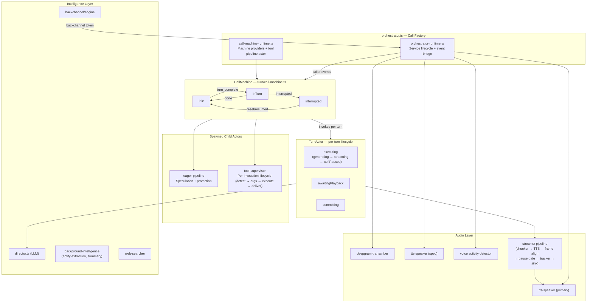
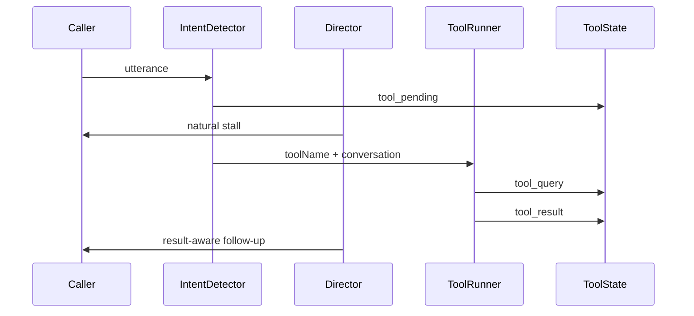
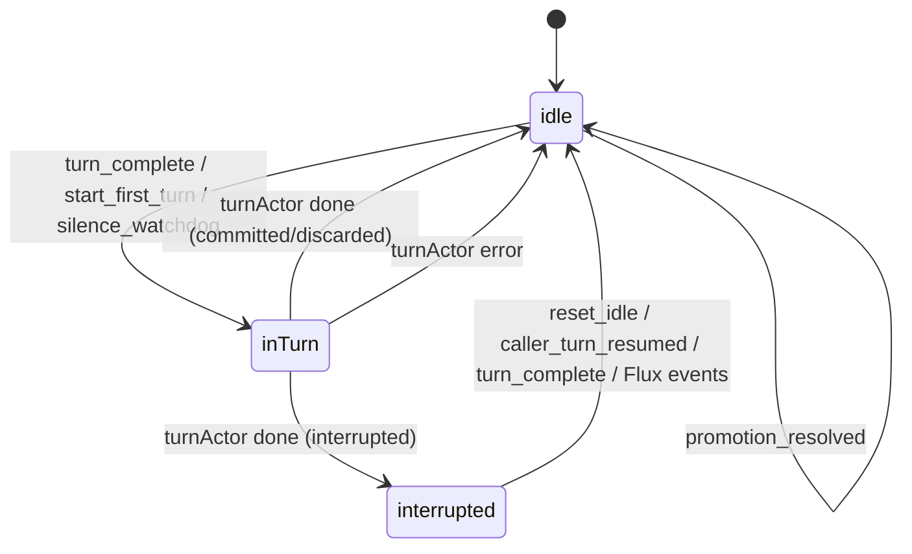
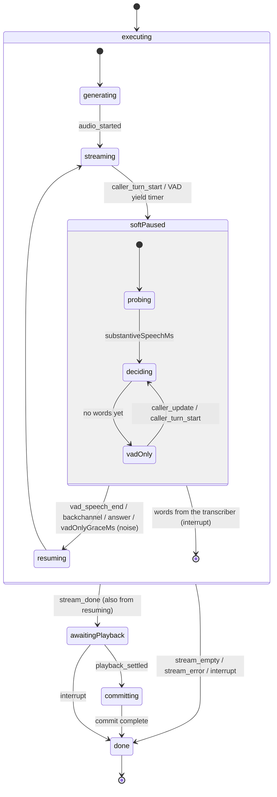
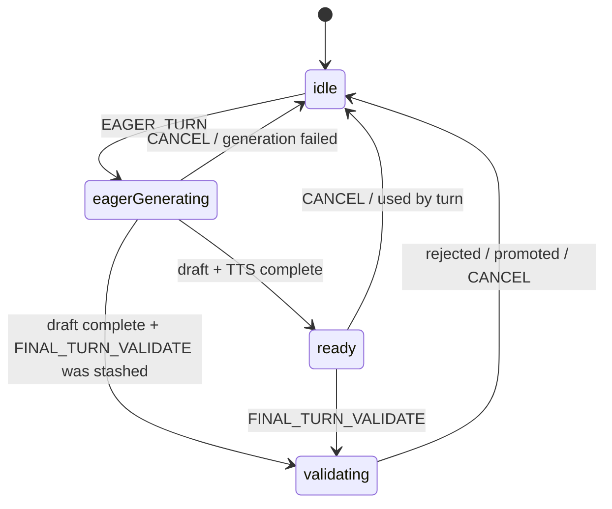
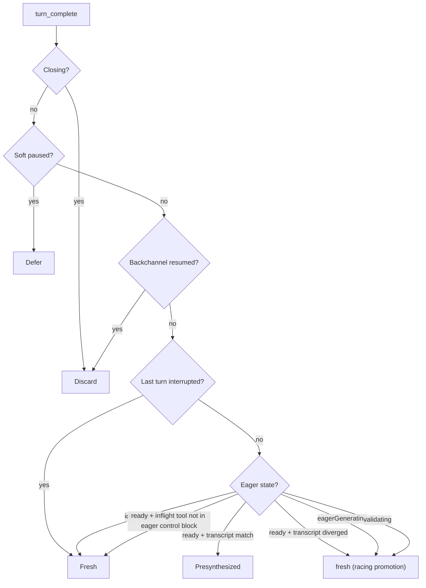

# Mimic — Realtime Voice Engine

Mimic powers voice calls. When a caller speaks, Mimic transcribes their speech in real time, generates an intelligent response, converts it to audio, and streams it back — all while managing interruptions, backchannels, tool execution, and eager pre-generation to minimize latency.

## How a Call Works

1. **Caller speaks** — audio flows into Deepgram Flux, which emits partial transcripts in real time.
2. **Eager EOT** — when Flux signals an early end-of-turn (`EagerEndOfTurn`), Mimic starts generating a response and pre-synthesizing audio via a dedicated spec TTS session before the caller has fully finished. It may also fire backchannel tokens ("mm-hmm", "right") so the caller feels heard.
3. **Caller finishes** — Flux emits the final `EndOfTurn`. If the eager draft is ready and the transcript hasn't diverged, pre-generated audio flushes immediately. If the transcript changed, a promotion classifier races against fresh generation to decide whether the eager draft is still usable.
4. **Agent responds** — the LLM response streams token-by-token into TTS (Cartesia Sonic), which streams audio chunks back to the caller.
5. **If the caller interrupts**, Mimic stops speaking and works out what they actually heard: Cartesia's word timestamps are lined up against how much audio had left the transport's playout queue (`estimateHeardPortion`), and the next response is prepared with that context (partial transcript committed with an em-dash).
6. **Ending the call** — the silence watchdog closes out an unresponsive caller; when the host enables `endCallEnabled`, the director can also finish a reply with `[end-call]`, which is stripped from speech and surfaces as `onHangupRequested('end_call_tag')`.
7. **Tools** — when the caller triggers a tool (booking, search, etc.), a fast intent detector starts a stall while a schema-aware tool runner extracts exact arguments, executes, and appends the query/result to persistent call state.

## System Architecture


```mermaid
graph TD
    subgraph Orchestrator["orchestrator.ts — Call Factory"]
        ORT["orchestrator-runtime.ts<br/>Service lifecycle + event bridge"]
        CMRT["call-machine-runtime.ts<br/>Machine providers + tool pipeline actor"]
    end

    subgraph CallMachine["CallMachine — turn/call-machine.ts"]
        Idle["idle"]
        InTurn["inTurn"]
        Interrupted["interrupted"]
    end

    subgraph Children["Spawned Child Actors"]
        Eager["eager-pipeline<br/>Speculation + promotion"]
        Tools["tool-supervisor<br/>Per-invocation lifecycle (detect → args → execute → deliver)"]
    end

    subgraph TurnActor["TurnActor — per-turn lifecycle"]
        Exec["executing<br/>(generating → streaming → softPaused)"]
        Await["awaitingPlayback"]
        Commit["committing"]
    end

    subgraph Audio["Audio Layer"]
        Transcriber["deepgram-transcriber"]
        TTSP["tts-speaker (primary)"]
        TTSS["tts-speaker (spec)"]
        VAD["voice activity detector"]
        Pipeline["streams/ pipeline<br/>(chunker → TTS → frame align<br/>→ pause gate → tracker → sink)"]
    end

    subgraph Intelligence["Intelligence Layer"]
        Dir["director.ts (LLM)"]
        BG["background-intelligence<br/>(entity extraction, summary)"]
        WS["web-searcher"]
        BC["backchannel/engine"]
    end

    ORT --> Transcriber
    ORT --> TTSP
    ORT --> TTSS
    ORT --> VAD
    ORT -->|caller events| CallMachine
    CMRT --> CallMachine
    CallMachine --> Eager
    CallMachine --> Tools
    CallMachine -->|invokes per turn| TurnActor
    TurnActor --> Dir
    TurnActor --> Pipeline
    Pipeline --> TTSP
    Idle -->|turn_complete| InTurn
    InTurn -->|done| Idle
    InTurn -->|interrupted| Interrupted
    Interrupted -->|reset/resumed| Idle
    BC -->|backchannel token| ORT
```

## Tool Lifecycle

Tools run through the **tool supervisor** (`supervisor-machine.ts`), which spawns a child **invocation actor** per detected tool intent. Each invocation owns its lifecycle (`detecting → awaiting_args → executing → ready`). A background classifier (`watcher.ts`) decides `execute / not_ready / none` per utterance. The director does NOT call tools natively — it speaks stall/filler via control-block guidance while tools run in the background. Results are committed to director history and injected into the `<tool_results>` section of subsequent control blocks. The agent naturally incorporates results on the next caller-triggered or silence-watchdog turn — no proactive follow-up turn is fired.

Writes clear two checks before they run. The watcher must quote the caller's authorizing words (checked against the caller's actual turns), and `write-gate.ts` checks that each argument value has a source: the caller's words, a prior read result, or text the integrator supplied for the call (`toolKnownValues`). Contact details and identifiers (emails, phone numbers, codes) with no source hold the write as `not_ready` with a `verify:<arg>` blocker and a director note asking for a readback; dates, names, and free text are only recorded as evidence spans or `unverifiedArgs`.


```mermaid
sequenceDiagram
    participant Caller
    participant IntentDetector
    participant Director
    participant ToolRunner
    participant ToolState
    Caller->>IntentDetector: utterance
    IntentDetector->>ToolState: tool_pending
    Director->>Caller: natural stall
    IntentDetector->>ToolRunner: toolName + conversation
    ToolRunner->>ToolState: tool_query
    ToolRunner->>ToolState: tool_result
    Director->>Caller: result-aware follow-up
```

**Control block signals** — the strategy receives an accumulating `<context>` block:

```text
tool_queries:
  checkCalendar({"date":"Thursday"}) -> completed
  bookMeeting({"startTime":"...","email":"john@gmail.com"}) -> executing

tool_results:
  checkCalendar: {"date":"2026-05-08","slots":[...]}

tool_pending: bookMeeting
```

When a tool is pending, the Director stalls naturally. When a result or tool error arrives, it is appended to `tool_results`; the Director uses conversation history to avoid repeating already-spoken facts.

**Transport:** Built-in `web_search` routes through `WebSearcher` (OpenAI Responses API). Custom tools route through a WebSocket callback bridge so SDK clients can execute tools locally without exposing secrets to the server.

## CallMachine States


```mermaid
stateDiagram-v2
    [*] --> idle
    idle --> inTurn: turn_complete / start_first_turn / silence_watchdog
    idle --> idle: promotion_resolved
    inTurn --> idle: turnActor done (committed/discarded)
    inTurn --> interrupted: turnActor done (interrupted)
    inTurn --> idle: turnActor error
    interrupted --> idle: reset_idle / caller_turn_resumed / turn_complete / Flux events
```

**idle** — waiting for the caller to finish speaking. Manages eager speculation and tool intent detection. Runs a silence watchdog (6s idle delay) that escalates through up to 3 follow-up prompts, then a closing turn, then hangup. Reenter on `caller_turn_start`, `caller_update`, `caller_eager_turn` to rearm the watchdog. Empty/whitespace-only updates are filtered by `isMeaningfulCallerUpdate`. When the caller asked us to wait (`isHoldRequest` on their transcript, or a silence follow-up the director answered with nothing) the window stretches to `holdIdleMs` (45s) until their next real turn.

**inTurn** — a TurnActor is active. Forwards interrupt/playback/VAD events and interim transcripts (`caller_update`) so a soft pause can tell a backchannel from a barge-in. On completion, emits `turn_outcome` and optionally delivers tool follow-ups from persistent tool state. Handles `promotion_resolved` for mid-turn eager swap — if fresh generation hasn't sent audio yet and no tools are inflight, the turn actor restarts with presynthesized audio under the same turnId; the superseded pipeline aborts its LLM stream and clears only its own `ActiveTurnHandle` (identity, not turnId), so the promoted turn stays steerable.

**End-of-turn confidence.** Flux commits a turn below `eotThreshold` only when its silence timeout fires. Finals under `lowConfidenceEot` (0.35) are treated as trailing off: the control block gets the `trailing-off` fragment and `selectStrategy` skips eager reuse so the hint reaches the model. Eager boundaries under the same floor are not speculated on. After the agent asks for a value that is read out in pieces (email, phone, spelling — `shouldUseCarefulEndpointing`), the runtime raises Flux's thresholds for exactly one caller turn (`carefulEotThreshold` / `carefulEotTimeoutMs`) and restores them when that turn arrives.

**interrupted** — transient state after an interrupted turn. Mirrors idle-state Flux handlers (`caller_turn_start`, `caller_update`, `caller_eager_turn`, `caller_turn_complete`) so end-of-turn signals aren't dropped after a substantive-speech interrupt.

## TurnActor Lifecycle


```mermaid
stateDiagram-v2
    [*] --> executing
    state executing {
        [*] --> generating
        generating --> streaming: audio_started
        streaming --> softPaused: caller_turn_start / VAD yield timer
        state softPaused {
            [*] --> probing
            probing --> deciding: substantiveSpeechMs
            deciding --> vadOnly: no words yet
            vadOnly --> deciding: caller_update / caller_turn_start
        }
        softPaused --> resuming: vad_speech_end / backchannel / answer / vadOnlyGraceMs (noise)
        softPaused --> [*]: words from the transcriber (interrupt)
        resuming --> streaming
    }
    executing --> awaitingPlayback: stream_done (also from resuming)
    executing --> done: stream_empty / stream_error / interrupt
    awaitingPlayback --> committing: playback_settled
    awaitingPlayback --> done: interrupt
    committing --> done: commit complete
    done --> [*]
```

**Soft pause decisions.** VAD opens the pause (audio is held, not cleared); the transcriber ends it. `probing` collects interim text for `substantiveSpeechMs`, then `deciding` classifies it with `classifyCallerSpeech`: listening noises ("mm-hmm", "right", "okay") resume and raise `backchannel_resumed` on the call machine so their eventual end-of-turn is dropped (`backchannel_handled`, with a 4s grace after the turn ends for Flux's slow commit); the same words after a question the agent just asked are an _answer_ — resume, and let the end-of-turn be a real turn; any other words interrupt. With VAD alone and no words, `vadOnly` gives Flux `vadOnlyGraceMs` more; still nothing means noise, and the agent resumes.

**Latency filler.** On `fresh` turns that answer a caller, the token source is wrapped by `withLatencyFiller`: if the model's first token is later than `latencyFillerMs` (1s), a short neutral filler ("Hmm.", "Let me see." for questions; "Mm-hmm." for statements) is spoken first. `ttftMs` still measures the model's own first token. Fillers count as sent audio, so a racing eager promotion that lands after one does not restart the turn.

## Interrupt Model

Interrupts stop the agent mid-speech when the caller starts talking, the call ends, or the caller speaks substantially during a soft-pause. The system is layered: CallMachine decides _when_ to interrupt, TurnActor decides _how_ to clean up, and the outcome feeds back into the next turn.

### Interrupt sources

| Source                                                            | InterruptReason             | Trigger                                         |
| ----------------------------------------------------------------- | --------------------------- | ----------------------------------------------- |
| New caller turn arrives while agent is speaking                   | `new_turn_started`          | `caller_turn_complete` during `inTurn`          |
| Call disconnects                                                  | `call_ended`                | Shutdown coordinator                            |
| Transcriber reports words during a soft-pause (not a backchannel) | `caller_substantive_speech` | `deciding` in TurnActor `softPaused`            |
| VAD yield timer fires during awaitingPlayback                     | `caller_started_speaking`   | Timer in TurnActor `awaitingPlayback.vadActive` |

### Flow

```text
CallMachine (inTurn)
  │
  │── receives caller_turn_complete or close ──►  sends { interrupt, reason } to TurnActor
  │                                                │
TurnActor                                          │
  │◄──────────────────────────────────────────────-─┘
  │
  │── buildInterruptPlan(currentState, trigger) → InterruptConfig
  │     ├── resources: which subsystems to tear down (abort, audio, tts, barge, softPause)
  │     ├── reason: why (derived from event or overridden by trigger)
  │     └── flags: fade, commit strategy, metrics
  │
  │── execute cleanup ─────────────────────────────────────────────────
  │     1. Abort LLM generation (AbortController.abort)
  │     2. Clear audio buffer + optional fade tail
  │     3. Interrupt TTS session (WebSocket cancel message)
  │     4. Compute heardPortion from the TTS word timeline + played-out ms (barge)
  │     5. Commit partial transcript to director history
  │     6. Cancel eager pipeline (sendParent → cancel_eager_from_turn)
  │     7. Assign interruptReason + clear stale state
  │
  │── enters done state ──► output: TurnOutcome { kind: 'interrupted', reason, interruptContext }
  │
CallMachine
  │── receives turnActor.onDone with interrupted outcome
  │── transitions to `interrupted` state
  │── emits turn_outcome event
  │
  │── interrupted state handles incoming Flux events (caller_turn_start,
  │   caller_update, caller_eager_turn, caller_turn_complete) identically
  │   to idle, preventing the agent from going dead
  │
  │── transitions back to idle on next caller event
```

### InterruptConfig derivation

The `buildInterruptPlan(state, trigger)` function in `turn-actor.ts` maps the TurnActor's current state to the correct cleanup resources:

| TurnActor state       | abort | audio+tts | barge | softPause | Notes                                                    |
| --------------------- | ----- | --------- | ----- | --------- | -------------------------------------------------------- |
| generating            | yes   | yes       | no    | no        | No audio sent yet; clears draft, commits user transcript |
| streaming             | yes   | yes       | yes   | no        | Audio in flight; estimates heard portion                 |
| softPaused            | yes   | yes       | yes   | yes       | Audio paused; skips fade, records soft-pause metrics     |
| awaiting              | no    | yes       | yes   | no        | Abort already nulled; audio/TTS may have residual        |
| awaiting (call_ended) | no    | no        | no    | no        | Just commits the draft                                   |

### Eager cancellation

The eager pipeline is cancelled in the following situations:

- **`promotion_resolved`** (parent-level default) — any failed or unused promotion cancels eager
- **`caller_turn_start`** — new utterance boundary invalidates speculation
- **Turn start with non-eager strategy** — `applyStartDispatch` cancels when strategy is fresh (non-racing)
- **TurnActor interrupt** — every interrupt cleanup calls `cancelEager` via `cancel_eager_from_turn`
- **`inTurn` promotion_resolved** — the complex racing-promotion handler cancels on failure/conflict

### caller_turn_resumed (Flux TurnResumed)

`TurnResumed` signals that the caller is still mid-utterance after an earlier `EagerEndOfTurn` was retracted. Its handling varies by state:

- **idle** — reenter to rearm the silence watchdog, mark caller active, reset silence count
- **inTurn** — mark eager as resumed (`MARK_TURN_RESUMED`), mark caller active, and forward to turnActor (which rearms the substantive-speech timer if soft-paused)
- **interrupted** — transition to idle, mark eager as resumed

## Eager Pipeline (Speculation)


```mermaid
stateDiagram-v2
    [*] --> idle
    idle --> eagerGenerating: EAGER_TURN
    eagerGenerating --> ready: draft + TTS complete
    eagerGenerating --> validating: draft complete + FINAL_TURN_VALIDATE was stashed
    eagerGenerating --> idle: CANCEL / generation failed
    ready --> idle: CANCEL / used by turn
    ready --> validating: FINAL_TURN_VALIDATE
    validating --> idle: rejected / promoted / CANCEL
```

When the caller finishes while eager is `ready` and the transcript matches, the strategy is `presynthesized` — audio flushes immediately (~0ms latency). In all other eager states (`eagerGenerating`, `ready` + diverged, `validating`), the strategy is `fresh` with `racingPromotion: true` — fresh generation starts immediately while the eager pipeline races to validate. If eager promotes before fresh sends audio, the turn actor swaps to presynthesized.

When `FINAL_TURN_VALIDATE` arrives while still in `eagerGenerating`, the request is stashed in `pendingValidate`. On generation completion, the machine transitions directly to `validating` (skipping `ready`) so the promotion classifier runs without delay.

Eager generation is tool-agnostic. Tool detection and execution run in the background; if a result arrives after an eager/fresh response has played, the call machine delivers it through the proactive follow-up path.

`MARK_TURN_RESUMED` can be sent at any time to note that the caller resumed speaking (Flux `TurnResumed`), which the eager context tracks to avoid stale promotions.

## Strategy Selection

`selectStrategy(input, world)` is a pure function that maps the full state of the call into exactly one dispatch path:


```mermaid
flowchart TD
    Start[turn_complete] --> Closing{Closing?}
    Closing -->|yes| Discard
    Closing -->|no| SoftPause{Soft paused?}
    SoftPause -->|yes| Defer
    SoftPause -->|no| BackchannelResumed{Backchannel resumed?}
    BackchannelResumed -->|yes| Discard
    BackchannelResumed -->|no| Interrupted{Last turn interrupted?}
    Interrupted -->|yes| Fresh
    Interrupted -->|no| EagerState{Eager state?}
    EagerState -->|idle / none| Fresh
    EagerState -->|ready + transcript match| Presynthesized
    EagerState -->|ready + transcript diverged| FreshRacing["fresh (racing promotion)"]
    EagerState -->|ready + inflight tool not in eager control block| Fresh
    EagerState -->|eagerGenerating| FreshRacing
    EagerState -->|validating| FreshRacing
```

## Control Block

The control block is a per-turn `<context>` injection that gives the LLM situational awareness. Strategies (API, intake, forms) build the data-only `<context>` block via `buildTurnControlBlock(ctx)`, then the shared signal layer (`turn-control-block-builder.ts`) appends:

- **Text quality** — the compiled `textQualityBlock` when present, otherwise transcript-quality guidance; every agent also receives the shared spoken-cadence steer
- **Active tool stall guidance** — when tools are executing, tells the model to buy time without confirming
- **End-call tag** — when `endCallEnabled`, how to hang up with `[end-call]`
- **Interrupt context** — what the caller heard before interrupting, what was left unsaid
- **Silence instruction** — when triggered by the silence watchdog, a check-in prompt that escalates to a closing goodbye
- **Trailing off** — when Flux committed the turn on silence at low confidence, a hint that the caller may not be done

The wording of every fragment lives in `prompts/control-block/*.md` (Handlebars for the parametrised ones); `control-block-utils.ts` only picks fragments and fills in runtime values. `createTurnControlBlockBuilder` loads them once per process and builds synchronously per turn.

## Backchannel Engine

Event-driven XState actor that fires short acknowledgement tokens while the caller is still speaking. Gates on min speech duration (~3s), refractory period (~4s), min word count (4), and low EOT confidence (<0.35 — avoids firing near end-of-thought). Suppresses after interrupted outcomes. Tokens: `mm-hmm`, `right`, `yeah`, `got-it`, `okay`, `uh-huh`, `sure`, `i-see`.

Classifier uses a fast background model (JSON schema) to pick the appropriate token or skip. Clips are pre-rendered per Cartesia voice id (`backchannel/audio/<ttsVoiceId>/`) with `scripts/generate-backchannel-clips.ts`; the token list and minimum word count live in `backchannel/tokens.ts`.

## Background Intelligence

Post-commit background tasks:

| Task                 | What it does                           | Why                                       |
| -------------------- | -------------------------------------- | ----------------------------------------- |
| Entity extraction    | Pulls names, companies from transcript | Keyterm boosting for transcriber accuracy |
| Conversation summary | Compresses older turns                 | Keeps prompt size bounded over long calls |

Keyterms (capped at 100) are pushed to `transcriber.configure({ keyterms })` so Deepgram improves recognition of domain-specific names over the course of the call. Initial keyterms can be seeded via `CallOrchestratorConfig.keyterms`.

All tasks share one bounded queue; summarization is additionally coalesced (`coalesceRuns`) so repeated commits collapse into a single follow-up summary. Prompts live in `prompts/instructions/` and address the agent by its persona name.

## Event Log

Every call records a per-call event log (`replay/event-log.ts`). The recorder is attached as XState's `inspect` hook, so every event the call machine and its children receive (VAD start/end, caller partials and finals with confidence, pipeline progress such as `first_audio_sent` and `playback_confirmed`, interrupts, timers, tool lifecycle) is appended with a sequence number and a millisecond offset on the engine clock, tagged with the receiving actor (`call`, `turnActor`, `eager-pipeline`, …). Emitted `turn_outcome`s and a closing `call_summary` (the metrics summary) are added by the runtime and orchestrator. Payloads are sanitized to JSON primitives (strings truncated, buffers and handles dropped) and capped at 50k events.

`orchestrator.close()` returns the log as `events`; the server stores it as JSONL beside the recording (`call-events/<callId>.jsonl`, `api_calls.event_log_path`). `replay/timing-counterfactuals.ts` turns a corpus of logs into threshold evidence: VAD-only hiccup durations and VAD-start → first-words delays for `substantiveSpeechMs` / `vadOnlyGraceMs`, the VAD-end → Flux-final gap and an early-commit guard sweep (would the partial at +N ms have matched the final?), caller response gaps for the silence watchdog, and an end-of-turn confidence histogram. `packages/server/src/scripts/sweep-thresholds.ts` runs them against S3 or a local directory.

## Audio Pipeline

The outbound pipeline is built fresh for every turn:

```text
Source Readable → SentenceChunker → TtsSynthesis → FrameAlign → PauseGate → PlaybackTracker → LiveKitSink
```

Sources: token Readable (fresh/first/proactive), PCM Readable (presynthesized — skips TTS).

The TTS speaker emits provider chunks untouched (plus Cartesia word timestamps); `frame-align` is the single place audio is cut into 20 ms frames. Sample formats are defined once in `shared/audio-format.ts`; all latency deltas use the injected monotonic `Clock`.

Two Cartesia TTS speaker instances are created per call: **primary** (used by the live turn pipeline) and **spec** (used by the eager pipeline for speculative synthesis). This prevents contention between live and speculative audio.

## External Services

| Area              | Service                     | Notes                                                                      |
| ----------------- | --------------------------- | -------------------------------------------------------------------------- |
| ASR               | Deepgram Flux (WebSocket)   | `MIMIC_FLUX_MODEL` (default `flux-general-en`), env-tunable EOT thresholds |
| TTS               | Cartesia Sonic (WebSocket)  | 48kHz PCM + word timestamps, dual sessions (primary + spec)                |
| Voice Director    | OpenAI or Anthropic         | Configurable via `MIMIC_DIRECTOR_PROVIDER` env                             |
| Background models | OpenAI                      | Backchannel, tool intent, eager validation, entity extraction, summary     |
| Web search        | OpenAI Responses API        | `web_search` tool type                                                     |
| Custom tools      | WebSocket callback bridge   | SDK executes tools locally, results returned over WS                       |
| VAD               | Silero v5 (local ONNX/WASM) | ~32ms frames at 16kHz, no cloud dependency                                 |

## Folder Guide

```text
mimic/
  orchestrator.ts                 — call factory, wires all subsystems
  orchestrator-runtime.ts         — service lifecycle (transcriber, TTS, VAD) + event bridge
  call-shutdown-coordinator.ts    — ordered shutdown + metrics publish
  turn-control-block-builder.ts   — control block assembly + shared signals
  index.ts                        — curated public API
  config.ts                       — env-backed secrets + validated tuning knobs
  models.ts                       — model registry + capability predicates

  turn/                           — turn coordination
    call-machine.ts               — call state machine (idle/inTurn/interrupted)
    call-machine-runtime.ts       — concrete providers + tool pipeline actor wiring
    call-machine-selectors.ts     — snapshot predicates
    turn-actor.ts                 — per-turn lifecycle (generate → stream → commit)
    strategy.ts                   — pure strategy selection
    caller-speech.ts              — backchannel / answer / speech classifier + hold-request detector
    types.ts                      — TurnOutcome, InterruptReason, CommittedTurn
    actors/
      run-turn-actor.ts           — generation + streaming pipeline (fromCallback)
      playback-wait-actor.ts      — playback confirmation (fromCallback)
      commit-actor.ts             — atomic commit + timing (fromPromise)

  audio/                          — speech and synthesis
    deepgram-transcriber.ts       — Deepgram Flux WebSocket + caller-turn events
    endpointing-policy.ts         — when an agent line warrants stricter end-of-turn detection
    tts-session.ts                — Cartesia TTS WebSocket session lifecycle (connect, context creation, reconnect)
    tts-speaker.ts                — text → PCM synthesis via Cartesia Sonic
    tts-sanitizer.ts              — LLM text cleanup, speech tag repair/validation, [end-call] extraction
    listen-transcriber.ts         — passive listen-only transcriber (no director/TTS)
    vad.ts                        — Silero VAD v5 via onnxruntime-web WASM
    audio-resample.ts             — PCM16 ↔ Float32 conversion + linear resampling
    ws-utils.ts                   — WebSocket construction, error normalization, awaitOpen
    transport-schemas.ts          — Zod schemas for Deepgram Flux + Cartesia TTS wire formats
    types.ts                      — AudioTransport, ListenTranscriber, transcriber interfaces
    streams/
      pipeline.ts                 — per-turn pipeline builder
      sources.ts                  — token / presynth Readables
      latency-filler.ts           — speaks a short filler when the model's first token is late
      sentence-chunker.ts         — tokens → sentence boundary events
      tts-synthesis.ts            — per-sentence TTS Transform
      frame-align.ts              — PCM rechunker + fade
      pause-gate.ts               — soft-pause buffering
      playback-tracker.ts         — sent-ms accounting + interrupt drain/fade
      livekit-sink.ts             — LiveKit Writable + AudioTransport
      types.ts                    — AudioTransport + stream interfaces

  intelligence/                   — LLM and tools
    director.ts                   — LLM streaming chat, history management, commit variants
    director-provider.ts          — OpenAI / Anthropic model selection
    eager-machine.ts              — speculation state machine
    eager-promotion-classifier.ts — spec→final transcript matching (conservative)
    tools/supervisor-machine.ts   — tool supervisor, spawns per-invocation child actors
    tools/invocation-machine.ts   — per-tool lifecycle (detecting/awaiting_args/executing/ready/claimed/delivered)
    tools/watcher.ts              — tool intent classifier: execute/not-ready/none per utterance
    tools/write-gate.ts           — evidence check for write arguments (caller words / read results / supplied data)
    tool-runner.ts                — shared ToolDefinition type
    tool-transport.ts             — web search + SDK socket tool execution routing
    web-searcher.ts               — OpenAI Responses API web search
    background-intelligence.ts    — post-commit async tasks (entities, summary, keyterms)
    control-block-utils.ts        — shared signal helpers; wording in prompts/control-block/
    types.ts                      — InterruptContext, EagerAudioSink

  backchannel/                    — active listening
    engine.ts                     — backchannel state machine (gates, classifier, fire)
    classifier.ts                 — backchannel token classifier
    clips.ts                      — pre-loaded PCM backchannel clips (per voice id)
    tokens.ts                     — token vocabulary + shared min word count
    types.ts                      — BackchannelCallerTurnEvent, BackchannelTurnOutcome

  replay/                         — per-call event log + offline analysis
    event-log.ts                  — XState inspect tap → sanitized JSONL event records
    timing-counterfactuals.ts     — soft-pause, early-commit, caller-gap, EOT-confidence sweeps over logs

  shared/                         — utilities
    task.ts                       — singleFlight, latestWinsQueue, coalesceRuns
    metrics.ts                    — call metrics + Sentry telemetry distributions
    prompt-turns.ts               — CallTurn + formatTurnsForPrompt
    streaming-types.ts            — DirectorStreamEvent + EagerAudioSink
    audio-format.ts               — PCM sample formats (ASR 16 kHz, TTS 48 kHz, 20 ms frames)
    audio-pacing.ts               — word timings, fade, heard-portion estimation
    clock.ts                      — injectable monotonic clock
    voice-persona.ts              — Aurora/Arlo persona configs + Cartesia voice IDs
    async-utils.ts                — withTimeout, isAbortLikeError, safeInvoke

  prompts.ts                      — loadPrompt / loadPromptTemplate (Handlebars) for prompts/
  prompts/                        — every model-facing instruction lives here, not in .ts
    instructions/                 — system prompts (classifiers, watcher, searcher, compiler, extractor)
    control-block/                — per-turn fragments (cadence, silence, tools, end-call, interrupt)
    voice-api-template.md         — system prompt template the goal compiler fills in
```
